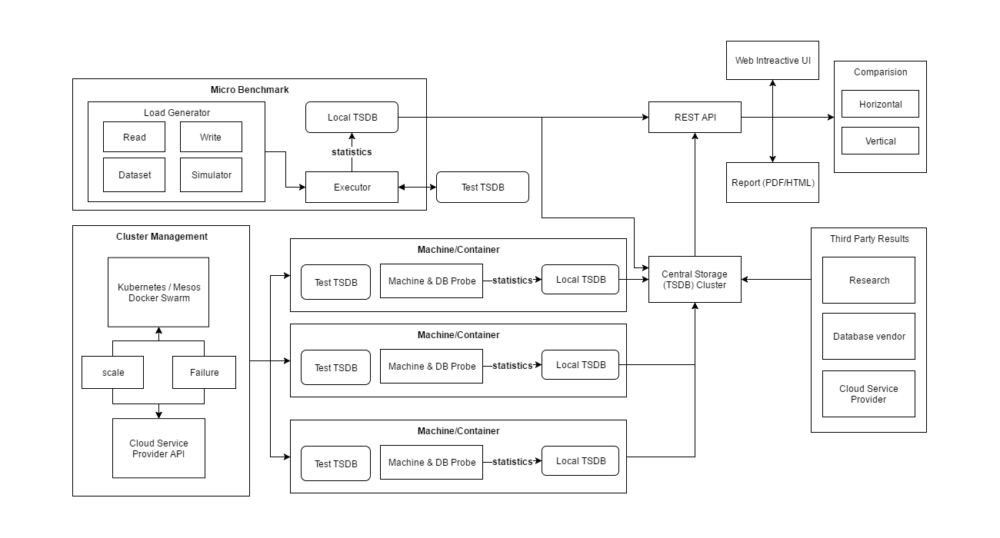

# Design



The Xephon-B benchmark suite contains three parts

- workload generator and executor
- probe on database machine which collect and store metrics of hardware and the database itself.
- benchmark result store and Web UI from which people can query by their interest and compare result from different sources (ie: database vendors, researchers)

## Workload generator and executor

This part is greatly inspired by [influxdb-comparisons](https://github.com/influxdata/influxdb-comparisons) and [YCSB](https://github.com/brianfrankcooper/YCSB)

- data generation, generate data based on configured range and distribution and save to disk
- data loading, load data and use insert into TSDB in batches (bulk load)
- query generation
- query execution
- concurrent load and query

### Data generation

Related issue: https://github.com/xephonhq/xephon-b/issues/1

Interface of generator

````
````

## Probe on database machine


## Benchmark result store and Web UI
